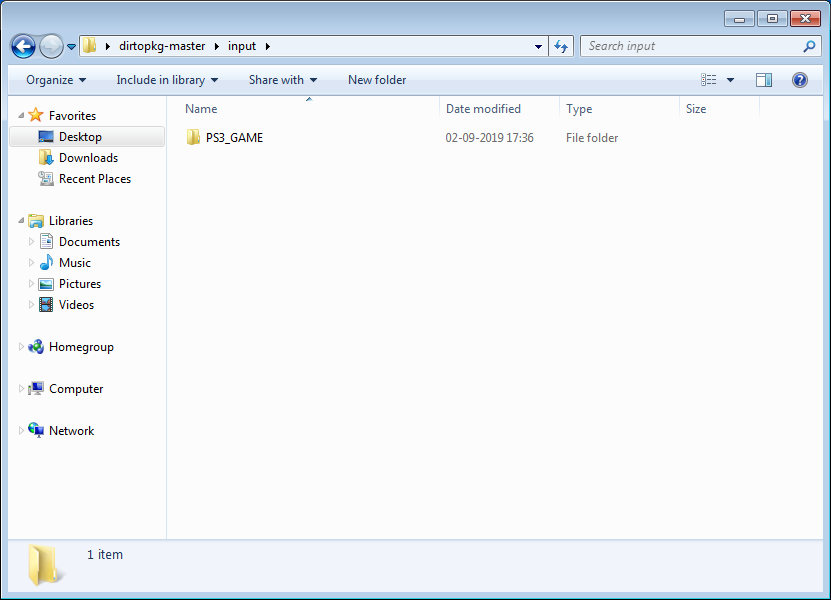
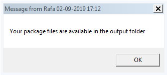

# Dir to PKG

A script which converts PS3 Directory games to PS3 PKG games (HAN Games)

## Usage

**Drop the *PS3_GAME* inside of the input folder like in the image below:**

**Inside this folder you can also drop the *act.dat* and the *idps.hex* files that you want to be resigned with your games**

Then go back to the main directory and run *convert.bat*.
It will automatically start to convert the *PS3_GAME* folder that you put inside of the input folder and later will output the installing PKG's to the output directory.

**During the conversion process you'll run into a couple lines saying this:**

You just simply press ***ENTER*** and the conversion process will continue...

**Once the conversion is finished you will get a message looking like this on your computer:**

Once you recieve this message, just press ok and go to the ouput folder, there you will have 3 PKG files, the ******GAME.pkg, the ******PATCH.pkg and the ******LIC.pkg.

**You just copy them over to the USB Stick and install them by this order:**

1. ******GAME.pkg
2. ******PATCH.pkg
3. ******LIC.pkg

### Warning:

* This only will work if the game has atleast one Update/Patch, if the game doesn't have any of those, it cannot be converted
